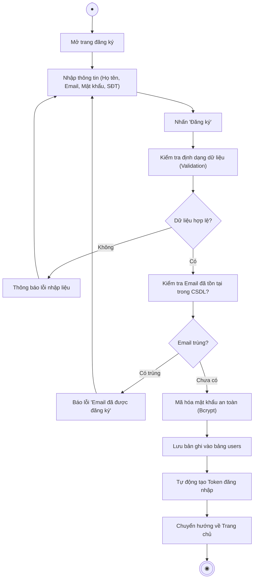
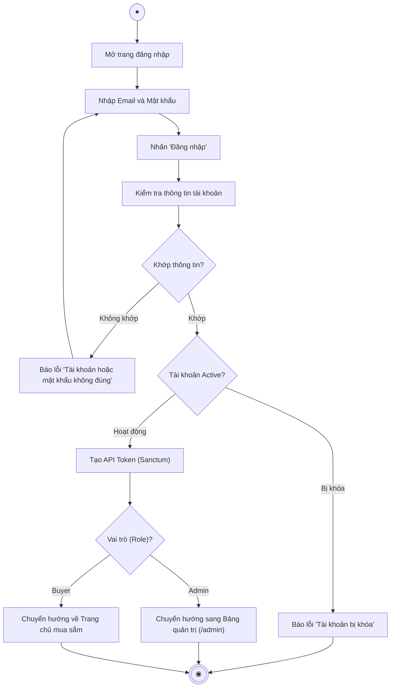
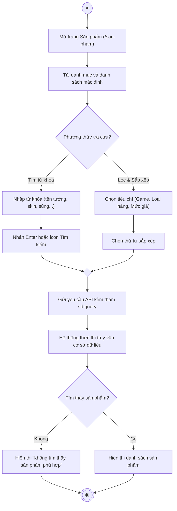
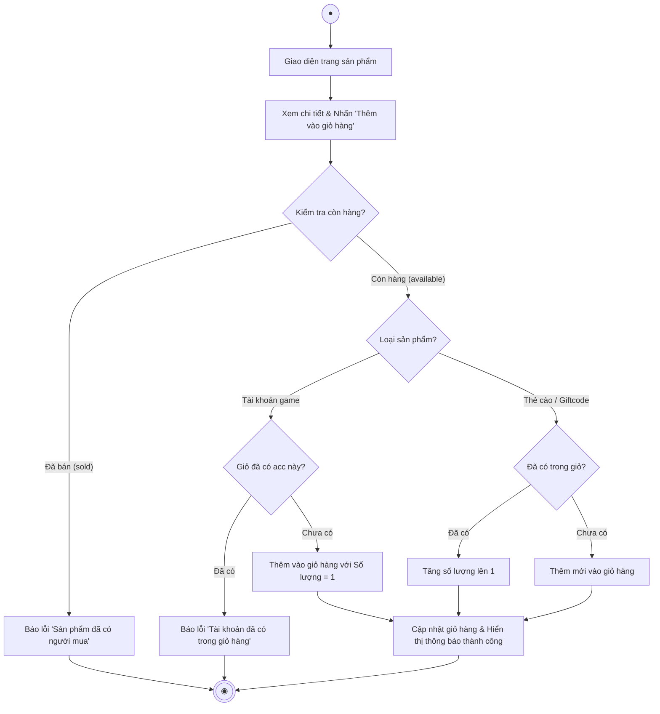
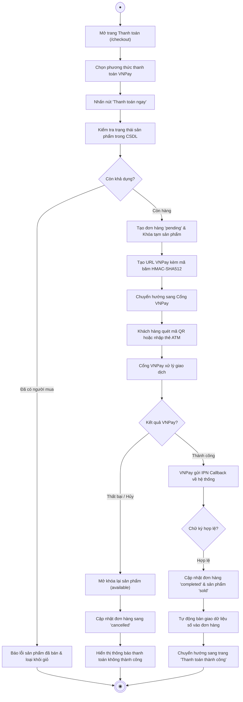
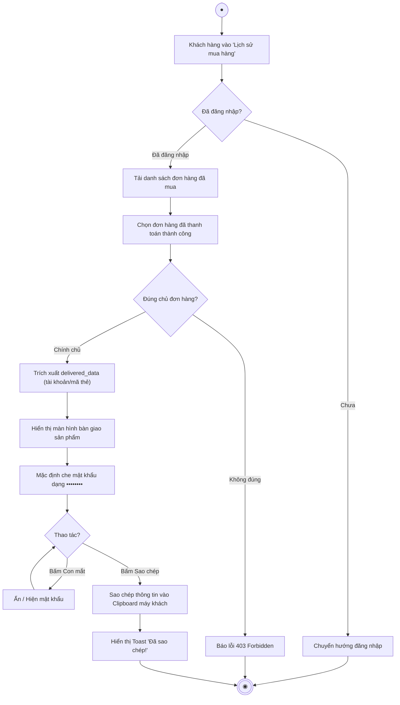
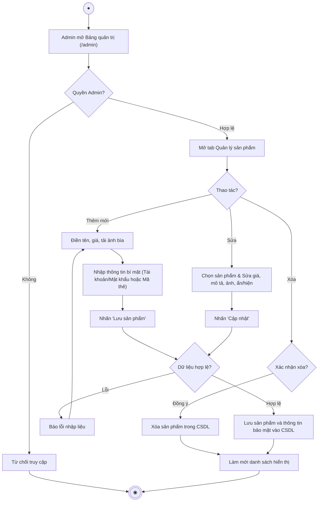
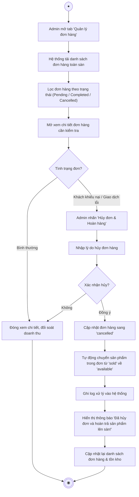

# TỔNG HỢP 8 BIỂU ĐỒ HOẠT ĐỘNG (ACTIVITY DIAGRAMS)
## DỰ ÁN: WEBSITE KINH DOANH TÀI KHOẢN, THẺ NẠP VÀ GIFTCODE GAME TRỰC TUYẾN

> **Tài liệu phục vụ Báo cáo Đồ án tốt nghiệp Công nghệ Thông tin**  
> **Sinh viên thực hiện:** Lý Văn Phòng  
> **Vị trí trong báo cáo:** Chương 2 - Phân tích & Thiết kế hệ thống (Mục 2.4.2 Biểu đồ hoạt động)

---

## MỤC LỤC DANH MỤC 8 BIỂU ĐỒ HOẠT ĐỘNG

| Mã biểu đồ | Tên biểu đồ hoạt động | Tác nhân chính | File tài liệu chi tiết |
| :---: | :--- | :--- | :--- |
| **AD-01** | Biểu đồ hoạt động Đăng ký tài khoản | Khách vãng lai | [register-activity-diagram.md](file:///d:/test/docs/register-activity-diagram.md) |
| **AD-02** | Biểu đồ hoạt động Đăng nhập hệ thống | Người dùng / Admin | [login-activity-diagram.md](file:///d:/test/docs/login-activity-diagram.md) |
| **AD-03** | Biểu đồ hoạt động Tìm kiếm và Lọc sản phẩm | Khách hàng | [product-search-activity-diagram.md](file:///d:/test/docs/product-search-activity-diagram.md) |
| **AD-04** | Biểu đồ hoạt động Thêm sản phẩm & Quản lý giỏ hàng | Người mua hàng | [add-to-cart-activity-diagram.md](file:///d:/test/docs/add-to-cart-activity-diagram.md) |
| **AD-05** | Biểu đồ hoạt động Đặt hàng và Thanh toán qua VNPay | Người mua & VNPay | [order-payment-activity-diagram.md](file:///d:/test/docs/order-payment-activity-diagram.md) |
| **AD-06** | Biểu đồ hoạt động Bàn giao & Xem thông tin sau mua | Người mua hàng | [delivery-viewing-activity-diagram.md](file:///d:/test/docs/delivery-viewing-activity-diagram.md) |
| **AD-07** | Biểu đồ hoạt động Quản lý sản phẩm số (Admin) | Quản trị viên | [admin-product-management-activity-diagram.md](file:///d:/test/docs/admin-product-management-activity-diagram.md) |
| **AD-08** | Biểu đồ hoạt động Quản lý & Xử lý đơn hàng (Admin) | Quản trị viên | [admin-order-management-activity-diagram.md](file:///d:/test/docs/admin-order-management-activity-diagram.md) |

---

## 1. BIỂU ĐỒ AD-01: ĐĂNG KÝ TÀI KHOẢN (REGISTER)

### Bảng phân làn Swimlanes (AD-01)
- **Khách hàng:** Điền biểu mẫu đăng ký $\rightarrow$ Nhấn Đăng ký $\rightarrow$ Nhận phản hồi hoặc được chuyển hướng về trang chủ.
- **Hệ thống:** Kiểm tra tính hợp lệ dữ liệu $\rightarrow$ Kiểm tra Email duy nhất $\rightarrow$ Mã hóa mật khẩu $\rightarrow$ Lưu bản ghi vào CSDL $\rightarrow$ Cấp phát token và phiên làm việc.

---

## 2. BIỂU ĐỒ AD-02: ĐĂNG NHẬP HỆ THỐNG (LOGIN)

### Bảng phân làn Swimlanes (AD-02)
- **Người dùng:** Nhập Email & Mật khẩu $\rightarrow$ Bấm Đăng nhập $\rightarrow$ Điều hướng về giao diện tương ứng.
- **Hệ thống:** Xác thực mật khẩu $\rightarrow$ Kiểm tra trạng thái kích hoạt tài khoản $\rightarrow$ Sinh Token $\rightarrow$ Phân quyền điều hướng (Admin vào `/admin`, Khách vào Trang chủ).

---

## 3. BIỂU ĐỒ AD-03: TÌM KIẾM VÀ LỌC SẢN PHẨM (SEARCH & FILTER)

### Bảng phân làn Swimlanes (AD-03)
- **Khách hàng:** Nhập từ khóa tìm kiếm hoặc bấm chọn các ô lọc (Game, Giá, Thẻ/Acc) $\rightarrow$ Xem kết quả hiển thị.
- **Hệ thống:** Tiếp nhận tham số $\rightarrow$ Xây dựng câu truy vấn SQL động $\rightarrow$ Trả về kết quả phân trang và giao diện sản phẩm.

---

## 4. BIỂU ĐỒ AD-04: THÊM SẢN PHẨM & QUẢN LÝ GIỎ HÀNG (CART)

### Bảng phân làn Swimlanes (AD-04)
- **Khách hàng:** Nhấn "Thêm vào giỏ hàng" $\rightarrow$ Nhận phản hồi và xem giỏ hàng được cập nhật.
- **Hệ thống:** Kiểm tra tính độc nhất của Tài khoản game (không cho trùng lặp, số lượng = 1) $\rightarrow$ Hỗ trợ cộng dồn số lượng cho Thẻ cào/Giftcode $\rightarrow$ Đồng bộ trạng thái giỏ hàng.

---

## 5. BIỂU ĐỒ AD-05: ĐẶT HÀNG VÀ THANH TOÁN QUA VNPAY (CHECKOUT)

### Bảng phân làn Swimlanes (AD-05)
- **Người mua:** Xác nhận thanh toán $\rightarrow$ Thao tác trên cổng VNPay $\rightarrow$ Nhận trang kết quả.
- **Hệ thống:** Khóa tạm sản phẩm $\rightarrow$ Sinh URL thanh toán $\rightarrow$ Nhận kết quả IPN và kiểm tra chữ ký SHA-512 $\rightarrow$ Hoàn tất đơn hàng và cập nhật tồn kho.
- **Cổng VNPay:** Tiếp nhận giao dịch, trừ tiền người mua và phản hồi dữ liệu an toàn về hệ thống.

---

## 6. BIỂU ĐỒ AD-06: BÀN GIAO & XEM THÔNG TIN SAU MUA (DELIVERY)

### Bảng phân làn Swimlanes (AD-06)
- **Người mua:** Vào lịch sử đơn hàng $\rightarrow$ Chọn xem chi tiết $\rightarrow$ Xem mật khẩu hoặc bấm sao chép để đăng nhập vào game.
- **Hệ thống:** Kiểm tra quyền sở hữu đơn hàng (Authorization Policy) $\rightarrow$ Trích xuất dữ liệu bàn giao $\rightarrow$ Hỗ trợ bảo mật ẩn mật khẩu và tương tác Clipboard.

---

## 7. BIỂU ĐỒ AD-07: QUẢN LÝ SẢN PHẨM SỐ - ADMIN (PRODUCTS)

### Bảng phân làn Swimlanes (AD-07)
- **Quản trị viên:** Chọn thêm/sửa/xóa $\rightarrow$ Nhập dữ liệu và thông tin tài khoản đăng nhập $\rightarrow$ Bấm lưu.
- **Hệ thống:** Kiểm tra quyền quản trị $\rightarrow$ Xác thực dữ liệu đầu vào $\rightarrow$ Lưu vào bảng CSDL tương ứng $\rightarrow$ Cập nhật lại giao diện.

---

## 8. BIỂU ĐỒ AD-08: QUẢN LÝ VÀ XỬ LÝ ĐƠN HÀNG - ADMIN (ORDERS)

### Bảng phân làn Swimlanes (AD-08)
- **Quản trị viên:** Theo dõi danh sách đơn hàng, lọc theo trạng thái $\rightarrow$ Khi có khiếu nại: Thực hiện hủy đơn và hoàn trả sản phẩm.
- **Hệ thống:** Cập nhật trạng thái đơn hàng $\rightarrow$ **Cơ chế tự động hoàn kho**: Quét các sản phẩm trong đơn và chuyển trạng thái từ `sold` trở lại `available` để sàn tiếp tục kinh doanh.
