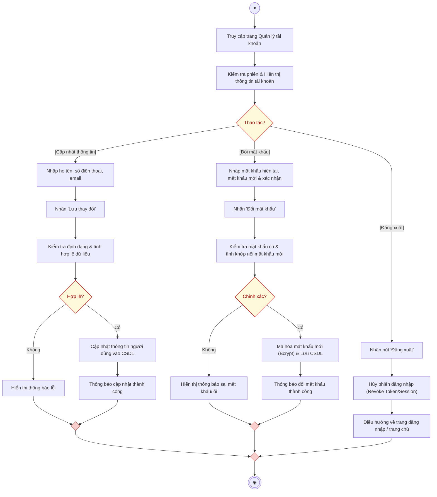

# AD-UC01 - Quản lý tài khoản (Activity Diagram)

Biểu đồ hoạt động mô tả chi tiết tiến trình thực hiện nhóm use case **Quản lý tài khoản (AD-UC01)** của Người dùng trong hệ thống. Sơ đồ được chuẩn hóa theo chuẩn UML phân chia làm 2 phân làn (**Người dùng** và **Hệ thống**), thể hiện đầy đủ các nhánh nghiệp vụ: **Xem thông tin cá nhân**, **Cập nhật thông tin hồ sơ**, **Đổi mật khẩu** và **Đăng xuất tài khoản**.

---

## 1. Sơ đồ hoạt động (Mermaid Diagram)

---

## 2. Bảng phân làn trách nhiệm (Swimlanes)

| Phân làn | Các hành động và quyết định |
| :--- | :--- |
| **Người dùng** | 1. Bắt đầu $\rightarrow$ Thực hiện **Truy cập trang Quản lý tài khoản**. 2. Xem thông tin cá nhân hiện tại được hiển thị trên giao diện. 3. Rẽ nhánh lựa chọn hành vi tại điểm **[Thao tác?]**: &nbsp;&nbsp;&nbsp;&nbsp;• **Nhánh 1: [Cập nhật thông tin cá nhân]:** &nbsp;&nbsp;&nbsp;&nbsp;&nbsp;&nbsp;&nbsp;&nbsp;- Nhập thông tin cần sửa (Họ tên, SĐT, Email). &nbsp;&nbsp;&nbsp;&nbsp;&nbsp;&nbsp;&nbsp;&nbsp;- Nhấn nút *"Lưu thay đổi"*. &nbsp;&nbsp;&nbsp;&nbsp;&nbsp;&nbsp;&nbsp;&nbsp;- Nhận phản hồi từ hệ thống (Lỗi hoặc Thông báo cập nhật thành công). &nbsp;&nbsp;&nbsp;&nbsp;• **Nhánh 2: [Đổi mật khẩu]:** &nbsp;&nbsp;&nbsp;&nbsp;&nbsp;&nbsp;&nbsp;&nbsp;- Nhập mật khẩu hiện tại, mật khẩu mới và xác nhận mật khẩu mới. &nbsp;&nbsp;&nbsp;&nbsp;&nbsp;&nbsp;&nbsp;&nbsp;- Nhấn nút *"Đổi mật khẩu"*. &nbsp;&nbsp;&nbsp;&nbsp;&nbsp;&nbsp;&nbsp;&nbsp;- Nhận thông báo kết quả (Mật khẩu không đúng / Lỗi quy chuẩn hoặc Đổi thành công). &nbsp;&nbsp;&nbsp;&nbsp;• **Nhánh 3: [Đăng xuất]:** &nbsp;&nbsp;&nbsp;&nbsp;&nbsp;&nbsp;&nbsp;&nbsp;- Nhấn nút *"Đăng xuất"* khỏi hệ thống. 4. Tiến trình kết thúc sau khi hoàn tất thao tác. |
| **Hệ thống** | 1. Tiếp nhận yêu cầu $\rightarrow$ **Kiểm tra phiên & Hiển thị thông tin tài khoản**. 2. Xử lý theo từng luồng nghiệp vụ tương ứng: &nbsp;&nbsp;&nbsp;&nbsp;• **Xử lý Cập nhật thông tin:** Kiểm tra định dạng dữ liệu (Email chuẩn, SĐT hợp lệ) $\rightarrow$ Nếu hợp lệ: Cập nhật CSDL và trả về thông báo thành công; Nếu không hợp lệ: Hiển thị lỗi. &nbsp;&nbsp;&nbsp;&nbsp;• **Xử lý Đổi mật khẩu:** Kiểm tra mật khẩu cũ xem có trùng khớp với bản băm trong CSDL không, kiểm tra độ dài $\ge 6$ ký tự $\rightarrow$ Nếu hợp lệ: Băm mật khẩu mới bằng thuật toán Bcrypt (`Hash::make()`), lưu vào CSDL và thông báo thành công; Nếu không: Hiển thị lỗi. &nbsp;&nbsp;&nbsp;&nbsp;• **Xử lý Đăng xuất:** Xóa phiên làm việc / Hủy token xác thực (Sanctum Token) $\rightarrow$ Điều hướng người dùng về trang đăng nhập hoặc trang chủ. 3. Gộp các luồng tại điểm Merge $\rightarrow$ Kết thúc tiến trình (End Node). |

---

## 3. Danh sách file đính kèm

- **File Vector SVG (dành cho Word báo cáo):** [account-management-activity-diagram.svg](file:///d:/test/docs/account-management-activity-diagram.svg)
- **File mã nguồn Draw.io:** [account-management-activity-diagram.drawio](file:///d:/test/docs/account-management-activity-diagram.drawio)
- **Tài liệu đặc tả:** [account-management-activity-diagram.md](file:///d:/test/docs/account-management-activity-diagram.md)
