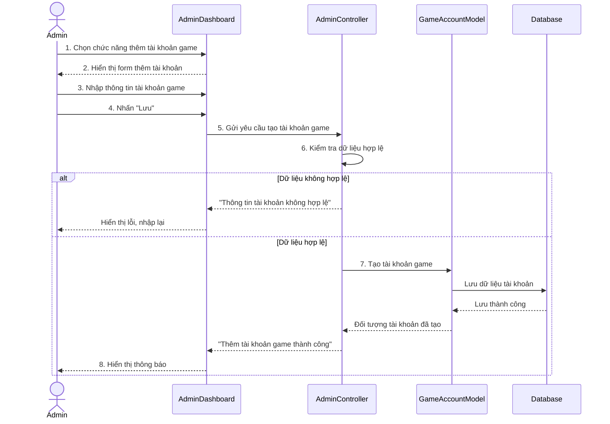

# Biểu đồ tuần tự Thêm tài khoản game

Biểu đồ mô tả luồng Admin thêm tài khoản game mới trong trang quản trị. Quy trình bao gồm nhập thông tin tài khoản, gửi yêu cầu tạo mới, kiểm tra dữ liệu bắt buộc và lưu bản ghi tài khoản game vào cơ sở dữ liệu.

