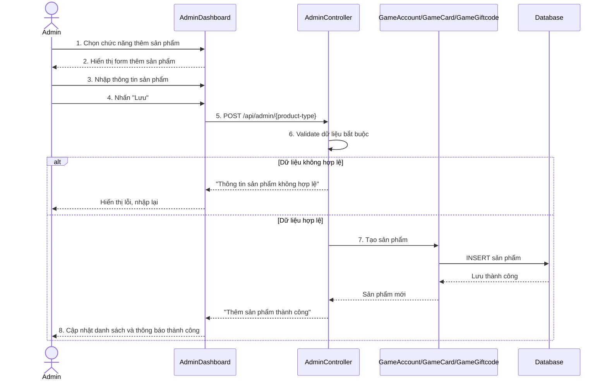

# Biểu đồ tuần tự Thêm sản phẩm

Biểu đồ mô tả luồng Admin thêm sản phẩm mới trong trang quản trị. Vì trang quản lý chỉ dành cho Admin, biểu đồ tập trung vào xử lý nhập liệu và lưu sản phẩm. Sản phẩm có thể là tài khoản game, thẻ game hoặc giftcode.

