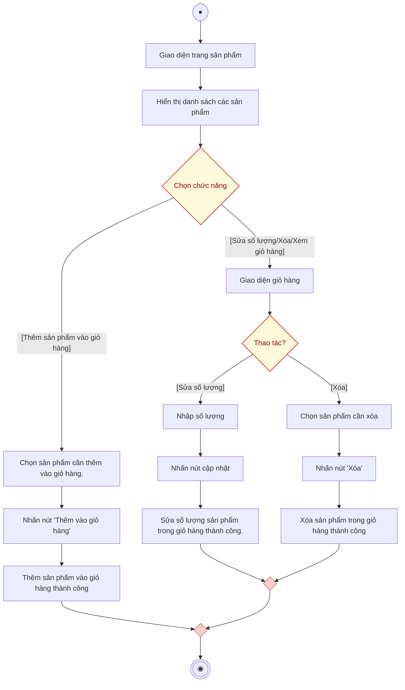

# AD-UC2 - Thêm sản phẩm & Quản lý giỏ hàng (Activity Diagram)

Biểu đồ hoạt động mô tả tiến trình hợp nhất giữa hai chức năng: **Thêm sản phẩm vào giỏ hàng** và **Quản lý giỏ hàng (Xem, Sửa số lượng, Xóa sản phẩm)**. Sơ đồ được chuẩn hóa theo 2 phân làn (**Người dùng** và **Hệ thống**).

---

## 1. Sơ đồ hoạt động (Mermaid Diagram)

---

## 2. Bảng phân làn trách nhiệm (Swimlanes)

| Phân làn | Các hành động và quyết định |
| :--- | :--- |
| **Người dùng** | 1. Bắt đầu $\rightarrow$ Mở **Giao diện trang sản phẩm**. 2. Xem danh sách sản phẩm $\rightarrow$ Thực hiện **[Chọn chức năng]**: &nbsp;&nbsp;&nbsp;&nbsp;• **Nhánh 1: [Thêm sản phẩm vào giỏ hàng]:** &nbsp;&nbsp;&nbsp;&nbsp;&nbsp;&nbsp;&nbsp;&nbsp;- Chọn sản phẩm cần thêm vào giỏ hàng. &nbsp;&nbsp;&nbsp;&nbsp;&nbsp;&nbsp;&nbsp;&nbsp;- Nhấn nút *"Thêm vào giỏ hàng"*. &nbsp;&nbsp;&nbsp;&nbsp;• **Nhánh 2: [Sửa số lượng/Xóa/Xem giỏ hàng]:** &nbsp;&nbsp;&nbsp;&nbsp;&nbsp;&nbsp;&nbsp;&nbsp;- Truy cập vào **Giao diện giỏ hàng**. &nbsp;&nbsp;&nbsp;&nbsp;&nbsp;&nbsp;&nbsp;&nbsp;- Rẽ nhánh quyết định thao tác: &nbsp;&nbsp;&nbsp;&nbsp;&nbsp;&nbsp;&nbsp;&nbsp;&nbsp;&nbsp;&nbsp;&nbsp;+ *[Sửa số lượng]:* **Nhập số lượng** $\rightarrow$ **Nhấn nút cập nhật**. &nbsp;&nbsp;&nbsp;&nbsp;&nbsp;&nbsp;&nbsp;&nbsp;&nbsp;&nbsp;&nbsp;&nbsp;+ *[Xóa]:* **Chọn sản phẩm cần xóa** $\rightarrow$ **Nhấn nút "Xóa"**. 3. Đến điểm kết thúc sau khi hoàn tất thao tác. |
| **Hệ thống** | 1. **Hiển thị danh sách các sản phẩm** khi người dùng duyệt trang sản phẩm. 2. Tiếp nhận và xử lý các yêu cầu nghiệp vụ tương ứng: &nbsp;&nbsp;&nbsp;&nbsp;• **Thêm sản phẩm vào giỏ hàng thành công.** &nbsp;&nbsp;&nbsp;&nbsp;• **Sửa số lượng sản phẩm trong giỏ hàng thành công.** &nbsp;&nbsp;&nbsp;&nbsp;• **Xóa sản phẩm trong giỏ hàng thành công.** 3. Gộp các luồng thành công $\rightarrow$ Điểm kết thúc (End Node). |

---

## 3. Danh sách file đính kèm

- **File Vector SVG (dành cho Word báo cáo):** [cart-management-activity-diagram.svg](file:///d:/test/docs/cart-management-activity-diagram.svg)
- **File mã nguồn Draw.io:** [cart-management-activity-diagram.drawio](file:///d:/test/docs/cart-management-activity-diagram.drawio)
- **Tài liệu đặc tả:** [cart-management-activity-diagram.md](file:///d:/test/docs/cart-management-activity-diagram.md)
