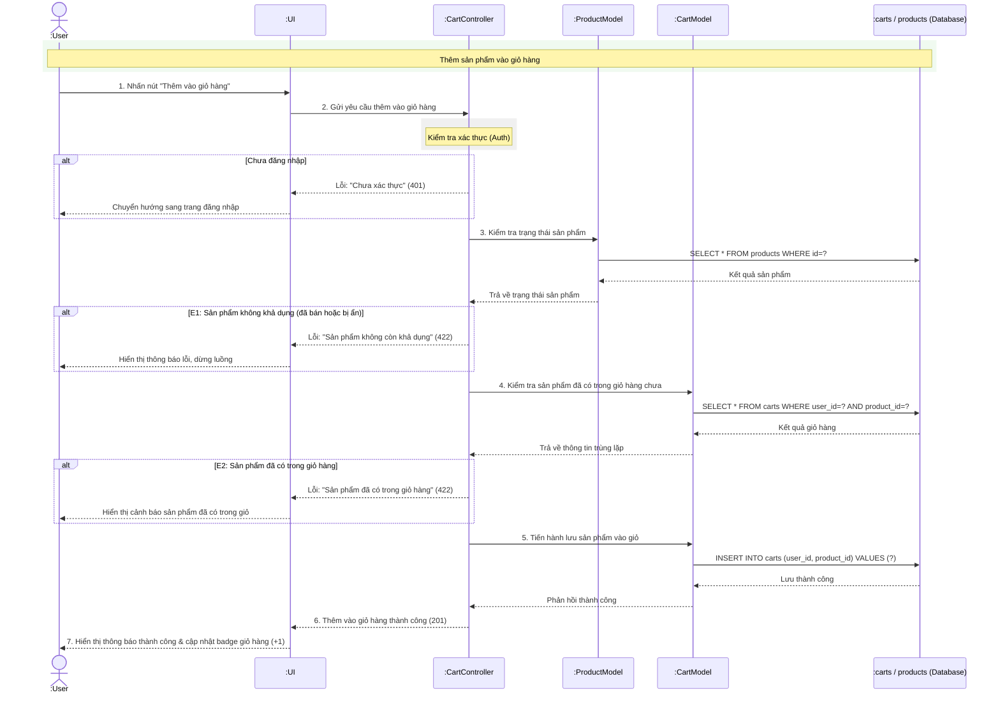

# Biểu đồ tuần tự Quản lý Giỏ hàng (UC13 - Thêm sản phẩm vào giỏ hàng)

Biểu đồ này mô tả quy trình kiểm tra nghiệp vụ chặt chẽ khi người dùng thực hiện thêm một sản phẩm (tài khoản game, thẻ game, hoặc giftcode) vào giỏ hàng. Vì sản phẩm số (tài khoản game) có số lượng tồn kho giới hạn độc nhất (=1), luồng xử lý yêu cầu xác minh trạng thái sản phẩm và kiểm tra trùng lặp để tránh xung đột dữ liệu.

## Giải thích chi tiết luồng xử lý (Step-by-step Flow)

### 1. Khởi động từ Frontend
- **Bước 1**: Người dùng (`:User`) đang xem sản phẩm, nhấn nút **"Thêm vào giỏ hàng"** trên giao diện `:UI`.
- **Bước 2**: Giao diện `:UI` (sử dụng API Client như Axios) gửi yêu cầu HTTP POST `POST /api/cart/add` kèm theo `product_id` đến bộ điều khiển `:CartController`.

### 2. Xác thực tài khoản (Auth Check)
- Bộ điều khiển `:CartController` đi qua middleware xác thực Laravel Sanctum để kiểm tra trạng thái đăng nhập:
  - **Trường hợp chưa đăng nhập**: Trả về mã lỗi **401 Unauthorized**. UI tiếp nhận lỗi, hiển thị thông báo yêu cầu đăng nhập và chuyển hướng người dùng về trang đăng nhập.

### 3. Kiểm tra tính khả dụng của sản phẩm (UC22)
- **Bước 3**: Bộ điều khiển gọi `:ProductModel` để kiểm tra trạng thái thực tế của sản phẩm thông qua phương thức `checkAvailability(product_id)`.
  - `:ProductModel` thực hiện truy vấn SQL: `SELECT * FROM products WHERE id=?` để lấy thông tin sản phẩm từ CSDL.
  - Cơ sở dữ liệu trả về kết quả sản phẩm cho `:ProductModel` để chuyển tiếp tới `:CartController`.
- **Trường hợp lỗi E1 (Sản phẩm không khả dụng)**:
  - Nếu sản phẩm không tồn tại, hoặc đã có trạng thái `sold` (đã bán), hoặc bị ẩn `status = 'hidden'`.
  - Bộ điều khiển dừng xử lý, trả về mã lỗi **422 Unprocessable Entity** kèm thông báo `"Sản phẩm không còn khả dụng"`. UI hiển thị thông báo lỗi lên màn hình và kết thúc luồng.

### 4. Kiểm tra trùng lặp sản phẩm trong giỏ hàng (UC16)
- **Bước 4**: Bộ điều khiển gọi `:CartModel` để kiểm tra xem tài khoản game này đã nằm trong giỏ hàng của người dùng hiện tại chưa qua phương thức `checkDuplicate(user_id, product_id)`.
  - `:CartModel` thực thi truy vấn SQL: `SELECT * FROM carts WHERE user_id=? AND product_id=?`.
  - CSDL trả về kết quả truy vấn cho `:CartModel` và phản hồi lại bộ điều khiển.
- **Trường hợp lỗi E2 (Sản phẩm đã có trong giỏ hàng)**:
  - Nếu bản ghi trùng lặp đã tồn tại trong giỏ hàng.
  - Bộ điều khiển dừng xử lý, phản hồi lỗi **422** kèm tin nhắn `"Sản phẩm đã có trong giỏ hàng"`. Giao diện `:UI` hiển thị cảnh báo tương ứng cho người dùng biết.

### 5. Thiết lập giỏ hàng & Cập nhật giao diện
- **Bước 5**: Khi cả hai điều kiện trên đều hợp lệ, `:CartController` yêu cầu `:CartModel` lưu trữ sản phẩm mới vào giỏ hàng của người dùng.
  - `:CartModel` chạy lệnh INSERT CSDL: `INSERT INTO carts (user_id, product_id) VALUES (?)`.
  - Cơ sở dữ liệu ghi nhận và thông báo **"Lưu thành công"**.
- **Hoàn tất luồng**:
  - **Bước 6**: Bộ điều khiển trả về mã trạng thái **201 Created** kèm dữ liệu giỏ hàng mới.
  - **Bước 7**: Giao diện `:UI` hiển thị popup thông báo thành công *"Đã thêm sản phẩm vào giỏ hàng"* và đồng thời cập nhật badge đếm số lượng giỏ hàng của người dùng trên thanh Header lên **`+1`** mà không cần tải lại trang.
