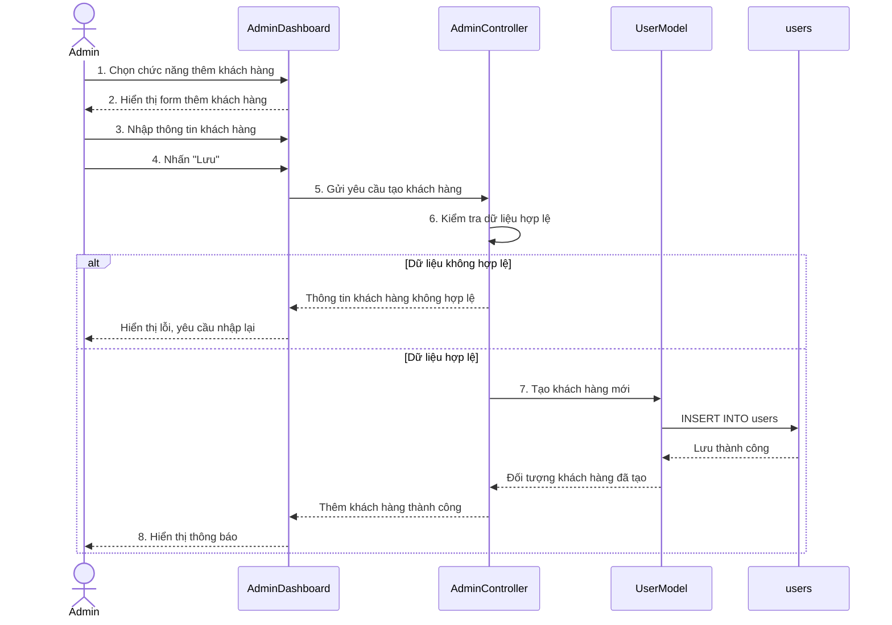

# Biểu đồ tuần tự Thêm khách hàng

Biểu đồ mô tả luồng Quản trị viên thêm khách hàng mới trong trang quản trị. Quy trình bao gồm nhập thông tin khách hàng, kiểm tra tính hợp lệ, tạo bản ghi khách hàng và hiển thị thông báo kết quả.

