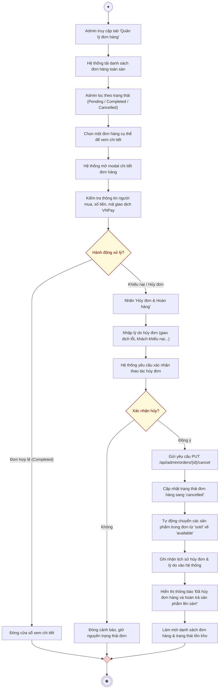

# AD-UC08 - Quản lý và Xử lý đơn hàng phía Quản trị viên (Activity Diagram)

Biểu đồ hoạt động mô tả tiến trình thực hiện use case **Quản lý và Xử lý đơn hàng**, phân chia theo 2 phân làn (**Quản trị viên** và **Hệ thống**), đặc biệt nhấn mạnh quy trình xử lý đơn hàng, đối soát thanh toán và cơ chế tự động hoàn trả sản phẩm số khi hủy đơn hàng.

---

## 1. Sơ đồ hoạt động (Mermaid Diagram)

---

## 2. Bảng phân làn trách nhiệm (Swimlanes)

| Phân làn | Các hành động và quyết định |
| :--- | :--- |
| **Quản trị viên (Admin)** | 1. Mở trang **Quản lý đơn hàng** tại Dashboard Admin. 2. Lọc danh sách theo trạng thái hoặc tìm kiếm mã giao dịch. 3. Mở xem chi tiết đơn hàng để đối soát thông tin. 4. Nếu phát sinh khiếu nại từ khách hàng: &nbsp;&nbsp;&nbsp;&nbsp;• Bấm chọn *"Hủy đơn & Hoàn hàng"*. &nbsp;&nbsp;&nbsp;&nbsp;• Nhập lý do hủy đơn và xác nhận thao tác. 5. Nhận kết quả cập nhật trên hệ thống. |
| **Hệ thống** | 1. **Tải và phân trang** toàn bộ danh sách đơn hàng từ CSDL `orders`. 2. **Hiển thị chi tiết đơn hàng**: Bao gồm người mua, sản phẩm mua, giá trị thanh toán, mã giao dịch VNPay. 3. **Xử lý hủy đơn và hoàn trả sản phẩm (Rollback Product)**: &nbsp;&nbsp;&nbsp;&nbsp;• Cập nhật bản ghi `orders.status = 'cancelled'`. &nbsp;&nbsp;&nbsp;&nbsp;• Tự động quét các sản phẩm trong đơn và chuyển trạng thái từ `sold` trở lại `available` để sàn tiếp tục bày bán. &nbsp;&nbsp;&nbsp;&nbsp;• Cập nhật lại doanh thu và hiển thị thông báo thành công cho Admin. |
