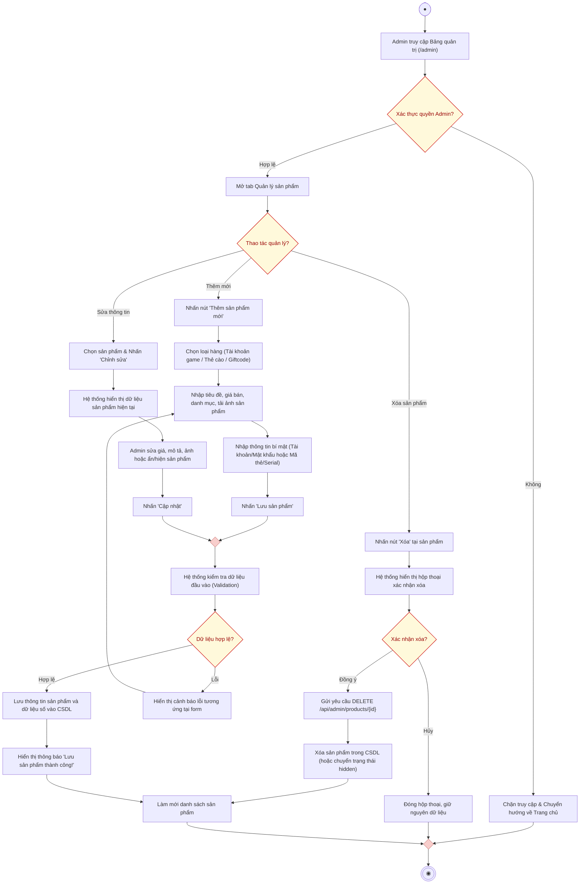

# AD-UC07 - Quản lý sản phẩm số phía Quản trị viên (Activity Diagram)

Biểu đồ hoạt động mô tả tiến trình thực hiện use case **Quản lý sản phẩm số (Thêm mới, Cập nhật, Xóa)** phía Admin, phân chia theo 2 phân làn (**Quản trị viên** và **Hệ thống**), đặc thù cho việc quản lý các mặt hàng số có dữ liệu nhạy cảm (tài khoản đăng nhập, thẻ nạp, giftcode).

---

## 1. Sơ đồ hoạt động (Mermaid Diagram)

---

## 2. Bảng phân làn trách nhiệm (Swimlanes)

| Phân làn | Các hành động và quyết định |
| :--- | :--- |
| **Quản trị viên (Admin)** | 1. Đăng nhập với tư cách Quản trị viên $\rightarrow$ Truy cập tab **Quản lý sản phẩm**. 2. Chọn hành vi tương ứng tại nút **Thao tác quản lý?**: &nbsp;&nbsp;&nbsp;&nbsp;• *Thêm mới:* Chọn loại hàng $\rightarrow$ Điền thông tin giá, mô tả, ảnh $\rightarrow$ **Nhập thông tin đăng nhập/mã thẻ bảo mật** $\rightarrow$ Bấm *"Lưu sản phẩm"*. &nbsp;&nbsp;&nbsp;&nbsp;• *Sửa:* Chọn sản phẩm $\rightarrow$ Thay đổi giá cả, mô tả hoặc trạng thái ẩn/hiện $\rightarrow$ Bấm *"Cập nhật"*. &nbsp;&nbsp;&nbsp;&nbsp;• *Xóa:* Nhấn xóa $\rightarrow$ Xác nhận đồng ý trên hộp thoại cảnh báo. 3. Xem danh sách được tự động cập nhật lại trên màn hình. |
| **Hệ thống** | 1. **Kiểm tra quyền hạn Admin (Middleware)**: Ngăn chặn người dùng thường truy cập trái phép. 2. **Kiểm tra dữ liệu đầu vào (Validation)**: Đảm bảo giá trị tiền tệ $> 0$, các trường bắt buộc không để trống. 3. **Xử lý lưu trữ**: Lưu trữ hình ảnh và ghi bản ghi vào bảng `game_accounts` hoặc `game_cards` tương ứng. 4. Đồng bộ lại bảng quản trị và gửi thông báo thành công cho người quản trị. |
