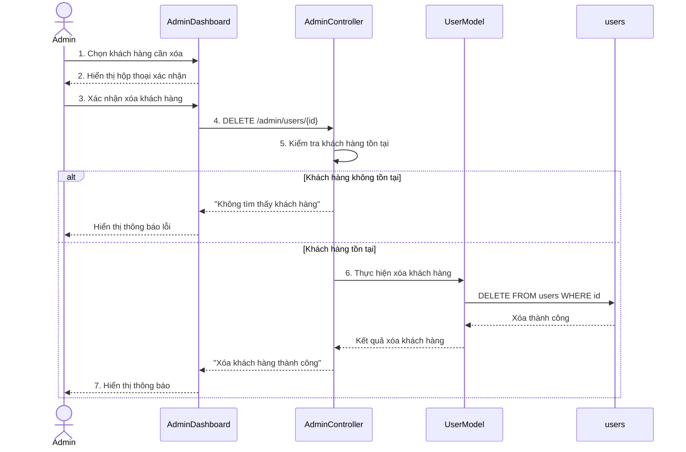

# Biểu đồ tuần tự Xóa khách hàng

Biểu đồ mô tả luồng Quản trị viên xóa thông tin khách hàng trong trang quản trị. Quy trình bao gồm hiển thị hộp thoại xác nhận, kiểm tra sự tồn tại của khách hàng và thực hiện xóa khỏi bảng `users`.

