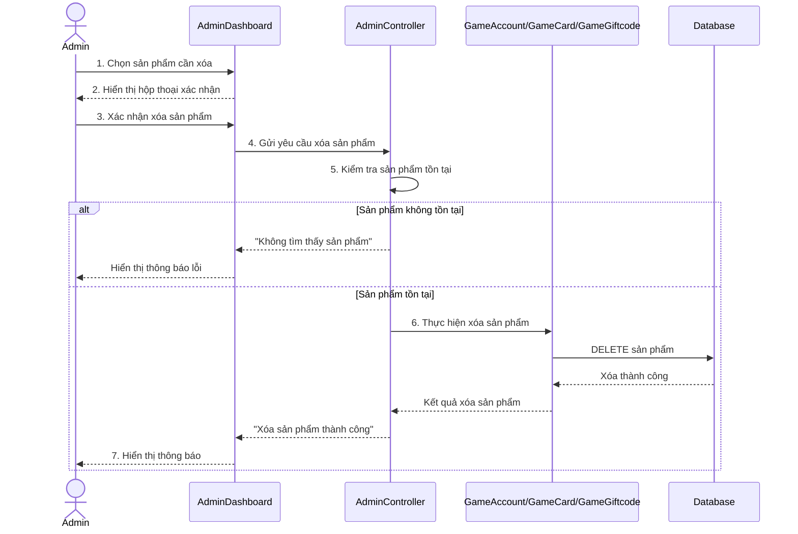

# Biểu đồ tuần tự Xóa sản phẩm

Biểu đồ mô tả luồng Admin xóa sản phẩm trong trang quản trị. Quy trình bao gồm chọn sản phẩm cần xóa, xác nhận thao tác, gửi yêu cầu xóa, kiểm tra điều kiện xử lý và cập nhật dữ liệu trong cơ sở dữ liệu.

