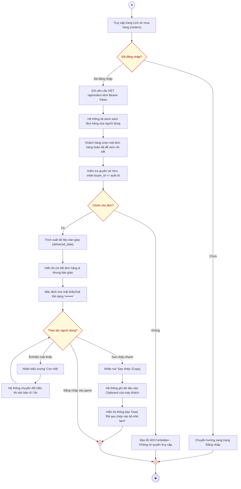

# AD-UC06 - Tự động bàn giao & Xem thông tin sản phẩm sau mua (Activity Diagram)

Biểu đồ hoạt động mô tả tiến trình thực hiện use case **Xem thông tin bàn giao sản phẩm số**, phân chia theo 2 phân làn (**Người mua** và **Hệ thống**), thể hiện rõ tính năng bảo mật quyền truy cập đơn hàng, ẩn/hiện mật khẩu và tiện ích sao chép thông tin bàn giao.

---

## 1. Sơ đồ hoạt động (Mermaid Diagram)

---

## 2. Bảng phân làn trách nhiệm (Swimlanes)

| Phân làn | Các hành động và quyết định |
| :--- | :--- |
| **Người mua hàng** | 1. Bắt đầu $\rightarrow$ Truy cập trang **Lịch sử mua hàng (`/orders`)**. 2. Chọn xem một đơn hàng đã mua. 3. Tại màn hình chi tiết: &nbsp;&nbsp;&nbsp;&nbsp;• Bấm nút "Con mắt" để xem rõ mật khẩu/mã thẻ. &nbsp;&nbsp;&nbsp;&nbsp;• Bấm nút *"Sao chép"* để copy thông tin đăng nhập mà không cần gõ lại thủ công. 4. Tiến hành đăng nhập vào game để trải nghiệm. |
| **Hệ thống** | 1. **Kiểm tra đăng nhập**: Nếu chưa có token thì chuyển hướng đăng nhập. 2. **Kiểm tra phân quyền sở hữu (Policy)**: Ngăn chặn người dùng xem trộm đơn hàng của tài khoản khác. 3. **Trích xuất thông tin bàn giao** (`delivered_data`) từ CSDL: &nbsp;&nbsp;&nbsp;&nbsp;• Nếu là Tài khoản game: Trả về Username & Password. &nbsp;&nbsp;&nbsp;&nbsp;• Nếu là Thẻ cào / Giftcode: Trả về Mã thẻ, Serial và hạn dùng. 4. Quản lý trạng thái che/mở mật khẩu và hỗ trợ tương tác với Clipboard của trình duyệt. |
