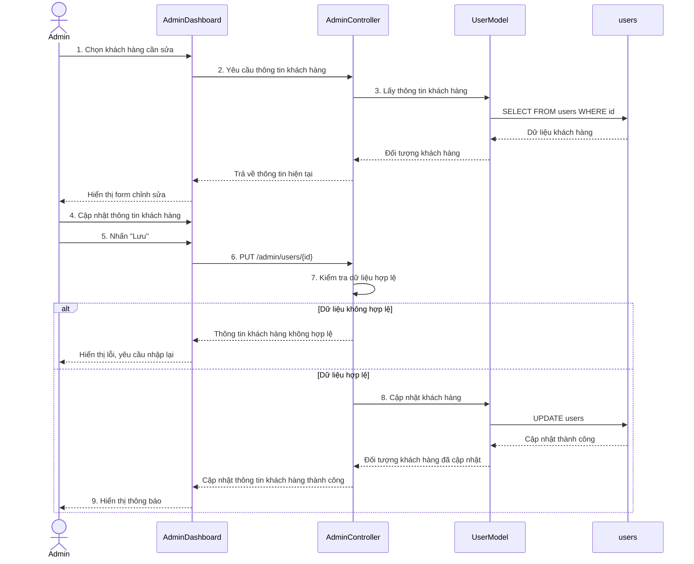

# Biểu đồ tuần tự Sửa thông tin khách hàng

Biểu đồ mô tả luồng Quản trị viên chỉnh sửa thông tin khách hàng trong trang quản trị. Quy trình bao gồm tải dữ liệu hiện tại, hiển thị form chỉnh sửa, kiểm tra dữ liệu cập nhật và lưu thay đổi vào bảng `users`.

