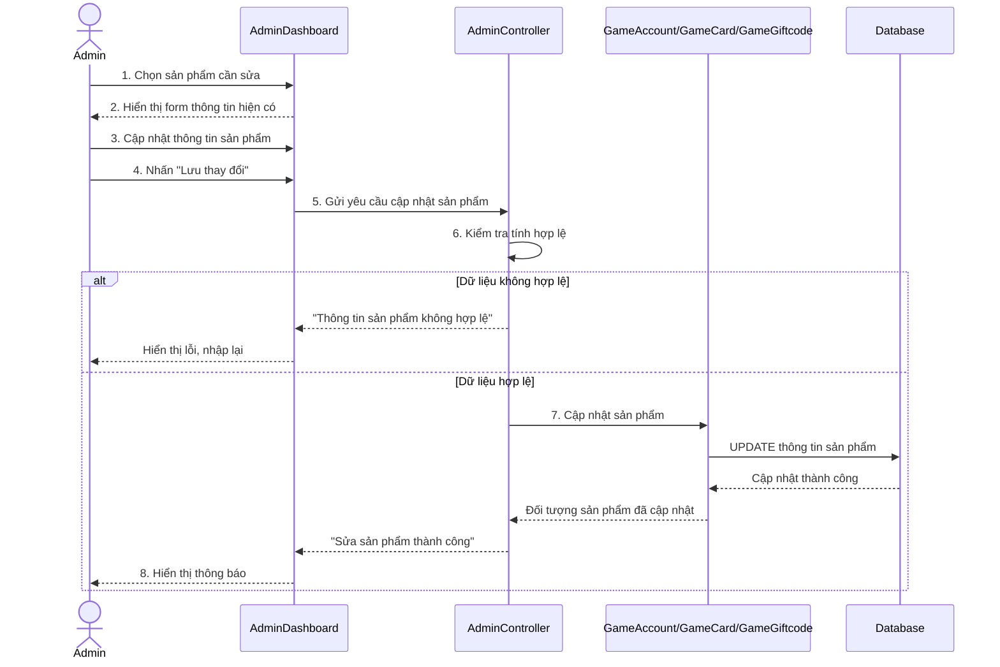

# Biểu đồ tuần tự Sửa sản phẩm

Biểu đồ mô tả luồng Admin sửa thông tin sản phẩm trong trang quản trị. Quy trình bao gồm chọn sản phẩm cần chỉnh sửa, hiển thị dữ liệu hiện có, cập nhật thông tin, kiểm tra tính hợp lệ và lưu thay đổi vào cơ sở dữ liệu.

