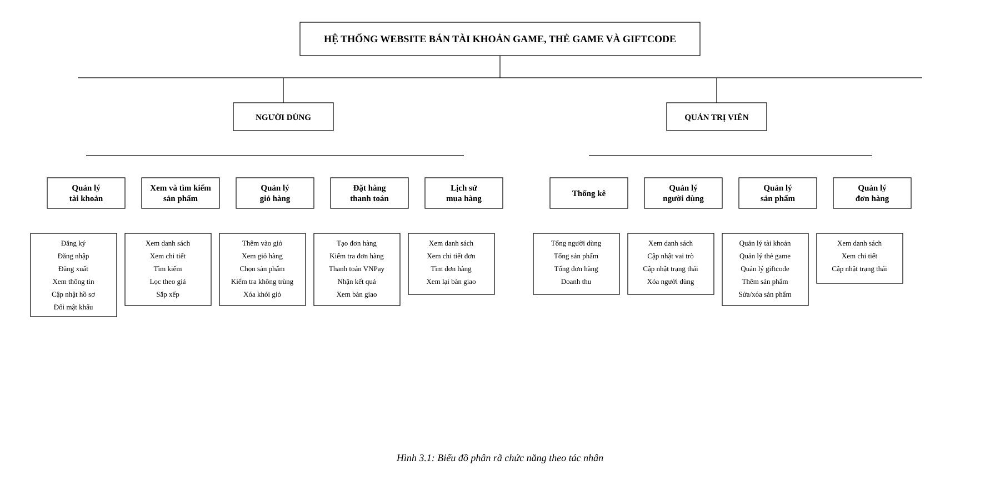

# Biểu đồ phân rã chức năng dự án

## Biểu đồ theo mẫu

File draw.io có thể chỉnh sửa trực tiếp: [functional-decomposition.drawio](./functional-decomposition.drawio)

Dự án là nền tảng GameAcc Shop gồm frontend Next.js và backend Laravel API. Biểu đồ phân rã chức năng được chia theo hai tác nhân chính là người dùng và quản trị viên.

```mermaid
flowchart TD
    A["Hệ thống website bán tài khoản game, thẻ game và giftcode"]

    A --> U["Người dùng"]
    U --> U1["Quản lý tài khoản"]
    U1 --> U11["Đăng ký"]
    U1 --> U12["Đăng nhập"]
    U1 --> U13["Đăng xuất"]
    U1 --> U14["Xem thông tin cá nhân"]
    U1 --> U15["Cập nhật hồ sơ"]
    U1 --> U16["Đổi mật khẩu"]

    U --> U2["Xem và tìm kiếm sản phẩm"]
    U2 --> U21["Xem danh sách"]
    U2 --> U22["Xem chi tiết"]
    U2 --> U23["Tìm kiếm"]
    U2 --> U24["Lọc theo giá"]
    U2 --> U25["Sắp xếp"]

    U --> U3["Quản lý giỏ hàng"]
    U3 --> U31["Thêm vào giỏ"]
    U3 --> U32["Xem giỏ hàng"]
    U3 --> U33["Chọn sản phẩm"]
    U3 --> U34["Kiểm tra không trùng"]
    U3 --> U35["Xóa khỏi giỏ"]

    U --> U4["Đặt hàng và thanh toán"]
    U4 --> U41["Tạo đơn hàng"]
    U4 --> U42["Kiểm tra đơn hàng"]
    U4 --> U43["Thanh toán VNPay"]
    U4 --> U44["Nhận kết quả"]
    U4 --> U45["Xem bàn giao"]

    U --> U5["Lịch sử mua hàng"]
    U5 --> U51["Xem danh sách đơn hàng"]
    U5 --> U52["Xem chi tiết đơn"]
    U5 --> U53["Tìm đơn hàng"]
    U5 --> U54["Xem lại thông tin bàn giao"]

    A --> AD["Quản trị viên"]
    AD --> A1["Thống kê"]
    A1 --> A11["Tổng người dùng"]
    A1 --> A12["Tổng sản phẩm"]
    A1 --> A13["Tổng đơn hàng"]
    A1 --> A14["Doanh thu"]

    AD --> A2["Quản lý người dùng"]
    A2 --> A21["Xem danh sách"]
    A2 --> A22["Cập nhật vai trò"]
    A2 --> A23["Cập nhật trạng thái"]
    A2 --> A24["Xóa người dùng"]

    AD --> A3["Quản lý sản phẩm"]
    A3 --> A31["Quản lý tài khoản game"]
    A3 --> A32["Quản lý thẻ game"]
    A3 --> A33["Quản lý giftcode"]
    A3 --> A34["Thêm sản phẩm"]
    A3 --> A35["Sửa/xóa sản phẩm"]

    AD --> A4["Quản lý đơn hàng"]
    A4 --> A41["Xem danh sách"]
    A4 --> A42["Xem chi tiết"]
    A4 --> A43["Cập nhật trạng thái"]
```

## Tóm tắt các nhóm chức năng

| Nhóm | Mô tả |
| --- | --- |
| Quản lý tài khoản | Đăng ký, đăng nhập, đăng xuất, xem và cập nhật hồ sơ, đổi mật khẩu. |
| Xem và tìm kiếm sản phẩm | Hiển thị tài khoản game, thẻ game, giftcode; hỗ trợ xem chi tiết, tìm kiếm, lọc giá và sắp xếp. |
| Giỏ hàng | Thêm sản phẩm duy nhất vào giỏ, kiểm tra không trùng, chọn sản phẩm thanh toán và xóa sản phẩm khỏi giỏ. |
| Đặt hàng và thanh toán | Tạo đơn hàng, kiểm tra trạng thái sản phẩm, thanh toán VNPay, nhận kết quả và xem thông tin bàn giao. |
| Lịch sử mua hàng | Cho người mua xem lại đơn hàng, tìm kiếm đơn hàng và xem lại thông tin bàn giao. |
| Quản trị | Thống kê, quản lý người dùng, quản lý sản phẩm và quản lý đơn hàng. |

## Căn cứ đọc mã nguồn

- Backend routes: `backend/routes/api.php`
- Backend controllers: `AuthController`, `GameAccountController`, `OrderController`, `AdminController`
- Frontend pages: `san-pham`, `gio-hang`, `checkout`, `lich-su-mua-hang`, `admin`
- Frontend stores/API: `cart-store`, `auth-store`, `api-client`
