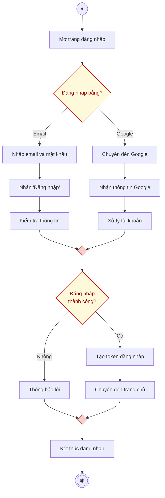

# AD-UC1.2 - Đăng nhập (Activity Diagram)

Biểu đồ hoạt động mô tả chi tiết tiến trình thực hiện use case **Đăng nhập hệ thống (AD-UC1.2)**, phân chia theo 2 phân làn (**Người dùng** và **Hệ thống**), gồm 2 phương thức: Đăng nhập qua Email và Đăng nhập qua Google.

---

## 1. Sơ đồ hoạt động (Mermaid Diagram)

---

## 2. Bảng phân làn trách nhiệm (Swimlanes)

| Phân làn | Các hành động và quyết định |
| :--- | :--- |
| **Người dùng** | 1. Bắt đầu $\rightarrow$ **Mở trang đăng nhập**. 2. Chọn nhánh: **Đăng nhập bằng?** (Email hoặc Google). 3. *Nếu chọn Email:* **Nhập email và mật khẩu** $\rightarrow$ **Nhấn "Đăng nhập"**. 4. Khi thành công: Tự động được **Chuyển đến trang chủ**. 5. Chuyển đến nút **Kết thúc đăng nhập** $\rightarrow$ Kết thúc tiến trình. |
| **Hệ thống** | 1. *Với luồng Email:* Tiếp nhận yêu cầu $\rightarrow$ **Kiểm tra thông tin** (truy vấn người dùng & kiểm tra mật khẩu Hash). 2. *Với luồng Google:* **Chuyển đến Google** $\rightarrow$ **Nhận thông tin Google** $\rightarrow$ **Xử lý tài khoản** (đồng bộ hoặc liên kết tài khoản). 3. Gộp 2 luồng tại điểm Merge $\rightarrow$ Rẽ nhánh **Đăng nhập thành công?**: &nbsp;&nbsp;&nbsp;&nbsp;• *Không:* **Thông báo lỗi** $\rightarrow$ Đến điểm gộp kết thúc. &nbsp;&nbsp;&nbsp;&nbsp;• *Có:* **Tạo token đăng nhập** (Sanctum Token) $\rightarrow$ Đưa người dùng chuyển đến trang chủ. |

---

## 3. Danh sách file đính kèm

- **File Vector SVG (dành cho Word báo cáo):** [login-activity-diagram.svg](file:///d:/test/docs/login-activity-diagram.svg)
- **File mã nguồn Draw.io:** [login-activity-diagram.drawio](file:///d:/test/docs/login-activity-diagram.drawio)
- **Tài liệu đặc tả:** [login-activity-diagram.md](file:///d:/test/docs/login-activity-diagram.md)
