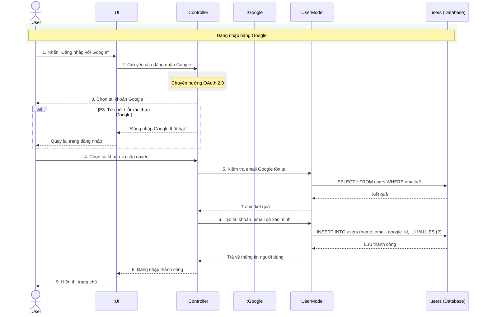

# Biểu đồ tuần tự đăng nhập (UC1.2 - Đăng nhập)

## Giải thích chi tiết luồng xử lý (Step-by-step Flow)

### Luồng Đăng nhập bằng Google (OAuth 2.0 Flow)

#### 1. Khởi động OAuth Flow từ Frontend
- **Bước 1**: Người dùng nhấn nút **"Đăng nhập với Google"** trên giao diện `:UI`.
- **Bước 2**: Giao diện `:UI` gửi yêu cầu đăng nhập Google đến bộ điều khiển `:Controller`.
- **Bước Chuyển hướng**: Bộ điều khiển `:Controller` thực hiện logic `Chuyển hướng OAuth 2.0` để chuyển người dùng sang cổng xác thực của Google.
- **Bước 3**: Bộ điều khiển phản hồi lại phía `:User` màn hình `Chọn tài khoản Google` (Dưới dạng popup hoặc chuyển hướng).

#### 2. Kịch bản hủy bỏ / lỗi xác thực từ phía Google
- **Trường hợp E3 (Từ chối / lỗi xác thực Google)**:
  - Nếu người dùng bấm hủy bỏ chọn tài khoản hoặc lỗi kết nối dịch vụ xác thực Google thất bại.
  - `:Controller` phát hiện lỗi và phản hồi tin nhắn `"Đăng nhập Google thất bại"` đến `:UI`.
  - `:UI` tiếp nhận phản hồi và đưa người dùng `Quay lại trang đăng nhập`.

#### 3. Xác thực & Thiết lập Tài khoản
- **Bước 4**: Người dùng thực hiện `Chọn tài khoản và cấp quyền` thành công trên cổng của Google, thông tin xác thực được gửi trực tiếp đến `:Controller`.
- **Bước 5**: `:Controller` tiếp nhận thông tin và yêu cầu `:UserModel` thực hiện `Kiểm tra email Google tồn tại` trong hệ thống.
  - `:UserModel` chạy câu lệnh SQL để truy vấn CSDL: `SELECT * FROM users WHERE email=?`.
  - Cơ sở dữ liệu `:users` trả về **"Kết quả"** và `:UserModel` trả kết quả này về cho `:Controller`.
- **Bước 6**: Nếu tài khoản chưa tồn tại, `:Controller` yêu cầu `:UserModel` thực hiện luồng `Tạo tài khoản, email đã xác minh`:
  - `:UserModel` chạy lệnh INSERT CSDL: `INSERT INTO users (name, email, google_id, ...) VALUES (?)`.
  - CSDL `:users` ghi nhận **"Lưu thành công"** và `:UserModel` trả thông tin đối tượng người dùng vừa tạo về cho `:Controller`.

#### 4. Thành công & Điều hướng
- **Bước 8**: `:Controller` phản hồi kết quả **"Đăng nhập thành công"** về phía `:UI`.
- **Bước 9**: `:UI` tiến hành **"Hiển thị trang chủ"** để hoàn tất toàn bộ luồng đăng nhập.
