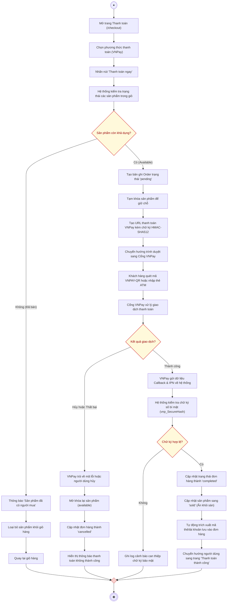

# AD-UC05 - Đặt hàng và Thanh toán trực tuyến qua VNPay (Activity Diagram)

Biểu đồ hoạt động mô tả tiến trình thực hiện use case **Đặt hàng và Thanh toán trực tuyến**, phân chia theo 3 phân làn (**Người mua**, **Hệ thống cửa hàng**, và **Cổng thanh toán VNPay**), bao gồm các kiểm tra chống trùng mua hàng và xử lý Webhook/IPN tự động.

---

## 1. Sơ đồ hoạt động (Mermaid Diagram)

---

## 2. Bảng phân làn trách nhiệm (Swimlanes)

| Phân làn | Các hành động và quyết định |
| :--- | :--- |
| **Người mua hàng** | 1. Bắt đầu $\rightarrow$ Truy cập trang **Thanh toán (`/checkout`)**. 2. Chọn phương thức thanh toán **VNPay** $\rightarrow$ Bấm *"Thanh toán ngay"*. 3. Tại cổng VNPay: Thực hiện quét mã QR hoặc nhập thông tin thẻ ATM ngân hàng. 4. Nhận thông báo kết quả: Trang thông báo thành công hoặc trang thông báo thất bại. |
| **Hệ thống website** | 1. **Kiểm tra tình trạng khả dụng** của sản phẩm trong CSDL: &nbsp;&nbsp;&nbsp;&nbsp;• *Nếu đã có người mua trước:* Báo lỗi, xóa sản phẩm đã bán và đưa khách về giỏ hàng. &nbsp;&nbsp;&nbsp;&nbsp;• *Nếu còn hàng:* Tạo đơn hàng `pending`, tạm khóa sản phẩm. 2. **Tạo URL cổng VNPay** kèm mã kiểm tra chữ ký SHA-512 $\rightarrow$ Chuyển hướng người mua. 3. **Tiếp nhận Webhook / IPN từ VNPay**: &nbsp;&nbsp;&nbsp;&nbsp;• Kiểm tra chữ ký số `vnp_SecureHash`. &nbsp;&nbsp;&nbsp;&nbsp;• *Nếu thanh toán thành công:* Đổi trạng thái đơn sang `completed`, đổi sản phẩm sang `sold`, tự động bàn giao thông tin bảo mật vào đơn hàng. &nbsp;&nbsp;&nbsp;&nbsp;• *Nếu thanh toán thất bại/hủy:* Đổi đơn sang `cancelled`, hoàn trả sản phẩm về `available`. |
| **Cổng VNPay** | 1. Hiển thị giao diện cổng thanh toán an toàn cho người dùng. 2. Giao tiếp với ngân hàng phát hành thẻ để thực hiện trừ tiền. 3. Trả về kết quả giao dịch và gửi dữ liệu IPN về Backend của website. |
