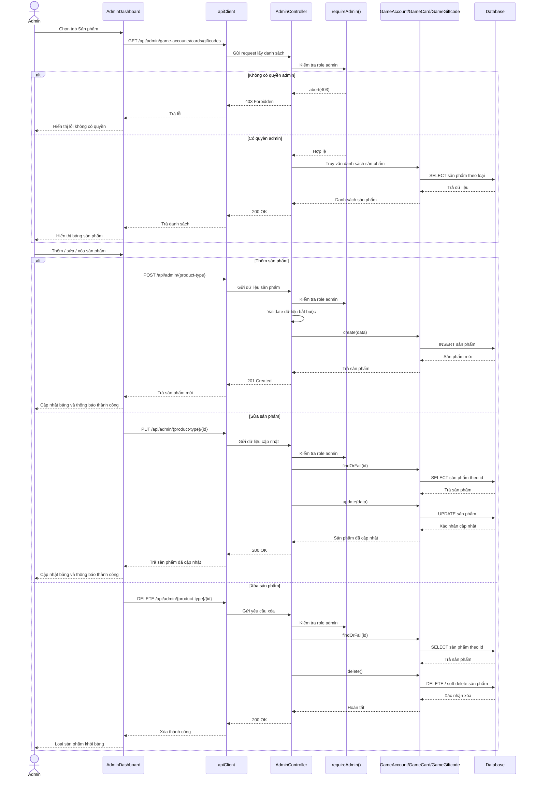

# Biểu đồ tuần tự Quản lý sản phẩm

Biểu đồ mô tả luồng quản trị sản phẩm trong hệ thống. Admin thao tác trên `AdminDashboard`, frontend gọi API quản trị, backend kiểm tra quyền admin rồi thêm/sửa/xóa sản phẩm ở một trong ba nhóm: tài khoản game, thẻ game hoặc giftcode.

