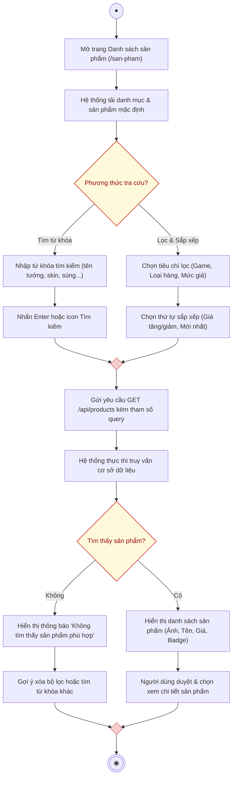

# AD-UC03 - Tìm kiếm và Lọc sản phẩm (Activity Diagram)

Biểu đồ hoạt động mô tả tiến trình thực hiện use case **Tìm kiếm và Lọc sản phẩm**, phân chia theo 2 phân làn (**Người dùng** và **Hệ thống**), hỗ trợ kết hợp giữa tìm kiếm theo từ khóa và lọc đa tiêu chí (danh mục game, loại sản phẩm, khoảng giá, sắp xếp).

---

## 1. Sơ đồ hoạt động (Mermaid Diagram)

---

## 2. Bảng phân làn trách nhiệm (Swimlanes)

| Phân làn | Các hành động và quyết định |
| :--- | :--- |
| **Người dùng** | 1. Bắt đầu $\rightarrow$ Truy cập trang **Danh sách sản phẩm (`/san-pham`)**. 2. Chọn hình thức tra cứu tại nút quyết định **Phương thức tra cứu?**: &nbsp;&nbsp;&nbsp;&nbsp;• *Nhánh 1 (Tìm từ khóa):* **Nhập từ khóa** (tên tướng, tên skin, súng...) $\rightarrow$ **Nhấn Tìm kiếm**. &nbsp;&nbsp;&nbsp;&nbsp;• *Nhánh 2 (Lọc & Sắp xếp):* **Chọn tiêu chí lọc** (Tựa game, Loại sản phẩm: Acc/Thẻ/Giftcode, Khoảng giá) $\rightarrow$ **Chọn thứ tự sắp xếp**. 3. Nhận phản hồi kết quả: &nbsp;&nbsp;&nbsp;&nbsp;• Nếu không có: Xem thông báo và có thể bấm xóa bộ lọc. &nbsp;&nbsp;&nbsp;&nbsp;• Nếu có: Duyệt danh sách và nhấn vào sản phẩm để xem chi tiết. 4. Đến nút Kết thúc (End Node). |
| **Hệ thống** | 1. Khi mở trang: **Tải danh mục & dữ liệu sản phẩm mặc định**. 2. Tiếp nhận tham số tìm kiếm/lọc $\rightarrow$ Gửi request API `GET /api/...` 3. **Thực thi truy vấn CSDL** (áp dụng các điều kiện `WHERE`, `LIKE %...%`, `ORDER BY`). 4. Rẽ nhánh quyết định **Tìm thấy sản phẩm?**: &nbsp;&nbsp;&nbsp;&nbsp;• *Không:* **Hiển thị thông báo rỗng** và gợi ý người dùng. &nbsp;&nbsp;&nbsp;&nbsp;• *Có:* **Render lưới sản phẩm** kèm phân trang, hiển thị hình ảnh đại diện, giá tiền và trạng thái. |
