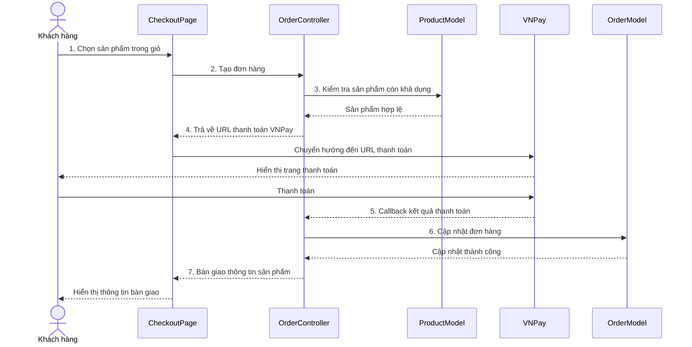

# Biểu đồ tuần tự Mua hàng / Thanh toán

```mermaid
sequenceDiagram
    actor Customer as Khách hàng
    participant UI as CheckoutPage
    participant Controller as OrderController
    participant Product as ProductModel
    participant VNPay as VNPay
    participant Order as OrderModel

    Customer->>UI: 1. Chọn sản phẩm trong giỏ
    UI->>Controller: 2. Tạo đơn hàng
    Controller->>Product: 3. Kiểm tra sản phẩm còn khả dụng
    Product-->>Controller: Sản phẩm hợp lệ
    Controller-->>UI: 4. Trả về URL thanh toán VNPay
    UI->>VNPay: Chuyển hướng đến URL thanh toán
    VNPay-->>Customer: Hiển thị trang thanh toán
    Customer->>VNPay: Thanh toán
    VNPay-->>Controller: 5. Callback kết quả thanh toán
    Controller->>Order: 6. Cập nhật đơn hàng
    Order-->>Controller: Cập nhật thành công
    Controller-->>UI: 7. Bàn giao thông tin sản phẩm
    UI-->>Customer: Hiển thị thông tin bàn giao
```
