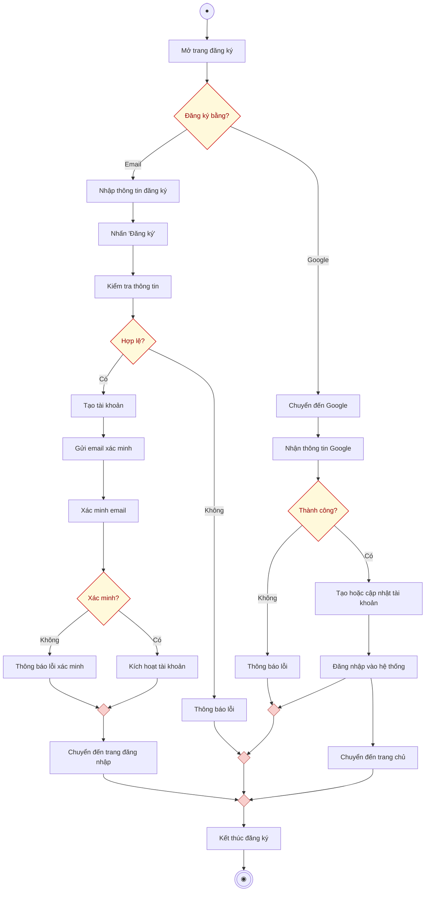

# AD-UC1.1 - Đăng ký tài khoản (Activity Diagram)

Biểu đồ hoạt động mô tả chi tiết tiến trình thực hiện use case **Đăng ký tài khoản (AD-UC1.1)**, phân chia theo 2 phân làn (**Khách vãng lai** và **Hệ thống**), gồm 2 phương thức: Đăng ký qua Email và Đăng ký qua Google.

---

## 1. Sơ đồ hoạt động (Mermaid Diagram)

---

## 2. Bảng phân làn trách nhiệm (Swimlanes)

| Phân làn | Các hành động và quyết định |
| :--- | :--- |
| **Khách vãng lai** | 1. Bắt đầu $\rightarrow$ **Mở trang đăng ký**. 2. Quyết định lựa chọn: **Đăng ký bằng?** (Email hoặc Google). 3. *Nếu chọn Email:* **Nhập thông tin đăng ký** $\rightarrow$ **Nhấn "Đăng ký"**. 4. *Sau khi nhận email xác minh:* Thực hiện **Xác minh email**. 5. Được **Chuyển đến trang đăng nhập** $\rightarrow$ Đến nút **Kết thúc đăng ký** $\rightarrow$ Điểm kết thúc. 6. *Nếu chọn Google:* Tự động được **Chuyển đến trang chủ** sau khi hoàn tất. |
| **Hệ thống** | 1. *Với luồng Email:* **Kiểm tra thông tin** $\rightarrow$ Rẽ nhánh **Hợp lệ?**: &nbsp;&nbsp;&nbsp;&nbsp;• *Không:* **Thông báo lỗi** $\rightarrow$ Chuyển về luồng kết thúc. &nbsp;&nbsp;&nbsp;&nbsp;• *Có:* **Tạo tài khoản** $\rightarrow$ **Gửi email xác minh**. 2. Tiếp nhận yêu cầu xác minh $\rightarrow$ Rẽ nhánh **Xác minh?**: &nbsp;&nbsp;&nbsp;&nbsp;• *Không:* **Thông báo lỗi xác minh**. &nbsp;&nbsp;&nbsp;&nbsp;• *Có:* **Kích hoạt tài khoản**. 3. *Với luồng Google:* **Chuyển đến Google** $\rightarrow$ **Nhận thông tin Google** $\rightarrow$ Rẽ nhánh **Thành công?**: &nbsp;&nbsp;&nbsp;&nbsp;• *Không:* **Thông báo lỗi**. &nbsp;&nbsp;&nbsp;&nbsp;• *Có:* **Tạo hoặc cập nhật tài khoản** $\rightarrow$ **Đăng nhập vào hệ thống** $\rightarrow$ Đưa người dùng chuyển đến trang chủ. |

---

## 3. Danh sách file đính kèm

- **File Vector SVG (dành cho Word báo cáo):** [register-activity-diagram.svg](file:///d:/test/docs/register-activity-diagram.svg)
- **File mã nguồn Draw.io:** [register-activity-diagram.drawio](file:///d:/test/docs/register-activity-diagram.drawio)
- **Tài liệu đặc tả:** [register-activity-diagram.md](file:///d:/test/docs/register-activity-diagram.md)
