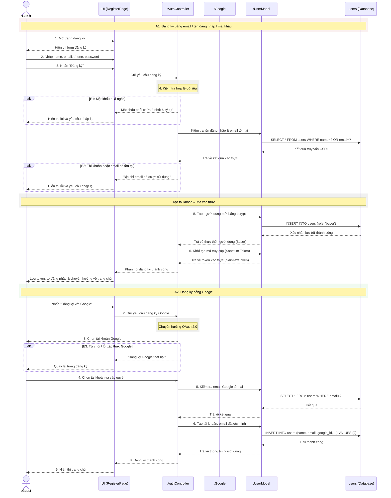

# Biểu đồ tuần tự đăng ký tài khoản (UC1.1 - Đăng ký)

## Giải thích chi tiết luồng xử lý (Step-by-step Flow)

### Phân đoạn A1: Đăng ký bằng email / tên đăng nhập / mật khẩu

#### 1. Khởi động từ Frontend
- **Bước 1**: Khách vãng lai (`:Guest`) mở giao diện đăng ký tài khoản.
- **Bước 2**: Nhập đầy đủ thông tin: `name`, `email`, `phone`, `password`.
- **Bước 3**: Nhấn nút **"Đăng ký"**, UI gửi yêu cầu HTTP POST kèm dữ liệu qua thư viện apiClient (Axios) đến backend.

#### 2. Kiểm tra dữ liệu đầu vào (Validation)
- **Bước 4**: `AuthController` thực hiện xác thực định dạng dữ liệu:
  - **Trường hợp E1 (Mật khẩu quá ngắn)**: Nếu mật khẩu ít hơn 6 ký tự, trả về mã lỗi **422 Unprocessable Entity**. UI hiển thị lỗi và yêu cầu người dùng nhập lại.
- **Kiểm tra trùng lặp tài khoản**: 
  - `AuthController` gọi `UserModel` để kiểm tra trùng lặp tên đăng nhập (`name`) hoặc `email`.
  - `UserModel` truy vấn DB: `SELECT * FROM users WHERE name=? OR email=?`.
  - **Trường hợp E2 (Tài khoản/email đã tồn tại)**: Nếu phát hiện bản ghi trùng khớp, Controller trả về lỗi **422** với thông báo tương ứng. UI hiển thị lỗi và yêu cầu nhập lại.

#### 3. Tạo tài khoản & Cấp mã truy cập
- **Bước 5**: Khi dữ liệu hoàn toàn hợp lệ, Controller mã hóa mật khẩu bằng `Bcrypt` và yêu cầu `UserModel` tạo tài khoản.
  - UserModel thực thi: `INSERT INTO users (role: 'buyer')`. Cơ sở dữ liệu ghi nhận lưu trữ thành công và trả về thông tin đối tượng người dùng vừa tạo.
- **Bước 6**: Controller gọi hàm sinh mã Sanctum Token (`createToken`) của người dùng để sinh ra mã token truy cập mới (`plainTextToken`).
- **Hoàn tất**: Server phản hồi thành công mã **201 Created** kèm thông tin người dùng và token. UI lưu token vào `localStorage`, đồng bộ state Auth và tự động đăng nhập đưa người dùng vào hệ thống.

---

### Phân đoạn A2: Đăng ký bằng Google (OAuth 2.0 Flow)

#### 1. Khởi động OAuth Flow từ Frontend
- **Bước 1**: Người dùng nhấn nút **"Đăng ký với Google"** trên giao diện `:UI`.
- **Bước 2**: Giao diện `:UI` gửi yêu cầu đăng ký Google đến bộ điều khiển `:AuthController`.
- **Bước Chuyển hướng**: Bộ điều khiển `:AuthController` thực hiện chuyển hướng `Chuyển hướng OAuth 2.0` để chuyển người dùng sang cổng xác thực của Google.
- **Bước 3**: Phía cổng Google hiển thị màn hình chọn tài khoản Google để khách hàng lựa chọn tài khoản (`Chọn tài khoản Google`).

#### 2. Kịch bản lỗi / hủy bỏ xác thực từ phía Google
- **Trường hợp E3 (Từ chối / lỗi xác thực Google)**:
  - Nếu người dùng bấm từ chối/hủy bỏ chọn tài khoản hoặc lỗi kết nối dịch vụ xác thực Google.
  - `:AuthController` phát hiện lỗi phản hồi thông báo `"Đăng ký Google thất bại"` đến `:UI`.
  - `:UI` tiếp nhận phản hồi và đưa người dùng `Quay lại trang đăng ký`.

#### 3. Xác thực & Thiết lập Tài khoản
- **Bước 4**: Người dùng thực hiện đăng nhập và cấp quyền thành công trên cổng Google, thông tin xác thực gửi trực tiếp đến `:AuthController`.
- **Bước 5**: `:AuthController` tiếp nhận và yêu cầu `:UserModel` thực hiện `Kiểm tra email Google tồn tại` trong hệ thống.
  - `:UserModel` chạy câu lệnh SQL để truy vấn CSDL: `SELECT * FROM users WHERE email=?`.
  - Cơ sở dữ liệu `:users` trả về **"Kết quả"** và `:UserModel` trả kết quả này về cho `:AuthController` để xác nhận.
- **Bước 6**: `:AuthController` yêu cầu `:UserModel` tiến hành luồng `Tạo tài khoản, email đã xác minh` để đăng ký tài khoản cho người dùng:
  - `:UserModel` chạy lệnh INSERT CSDL: `INSERT INTO users (name, email, google_id, ...) VALUES (?)`.
  - CSDL `:users` ghi nhận **"Lưu thành công"** và `:UserModel` trả thông tin đối tượng người dùng vừa tạo về cho `:AuthController`.

#### 4. Thành công & Điều hướng
- **Bước 8**: `:AuthController` xác nhận **"Đăng ký thành công"** và phản hồi về `:UI`.
- **Bước 9**: `:UI` tiến hành **"Hiển thị trang chủ"** để hoàn tất toàn bộ luồng đăng ký.
