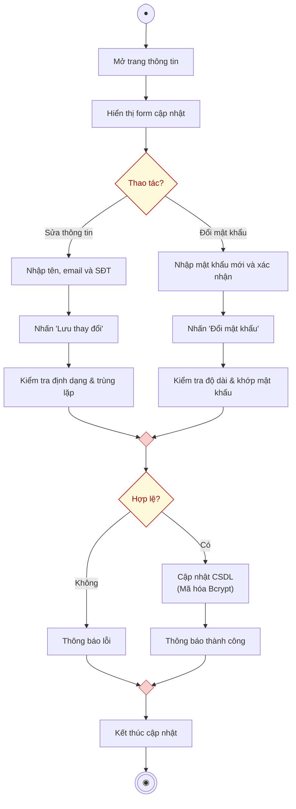

# AD-UC1.3 - Cập nhật thông tin cá nhân & Đổi mật khẩu (Activity Diagram)

Biểu đồ hoạt động mô tả chi tiết tiến trình thực hiện use case **Cập nhật thông tin cá nhân & Đổi mật khẩu (AD-UC1.3)**, phân chia theo 2 phân làn (**Người dùng** và **Hệ thống**), hỗ trợ 2 thao tác: Cập nhật thông tin cơ bản (Họ tên, email, số điện thoại) và Thay đổi mật khẩu tài khoản.

---

## 1. Sơ đồ hoạt động (Mermaid Diagram)

---

## 2. Bảng phân làn trách nhiệm (Swimlanes)

| Phân làn | Các hành động và quyết định |
| :--- | :--- |
| **Người dùng** | 1. Bắt đầu $\rightarrow$ **Mở trang thông tin**. 2. Chọn thao tác: **Sửa thông tin** hoặc **Đổi mật khẩu**. 3. *Nếu sửa thông tin:* **Nhập tên, email và SĐT** $\rightarrow$ **Nhấn "Lưu thay đổi"**. 4. *Nếu đổi mật khẩu:* **Nhập mật khẩu mới và xác nhận** $\rightarrow$ **Nhấn "Đổi mật khẩu"**. 5. Nhận kết quả: Xem **Thông báo thành công** (hoặc thông báo lỗi) $\rightarrow$ Đến nút **Kết thúc cập nhật** $\rightarrow$ Điểm kết thúc. |
| **Hệ thống** | 1. Tiếp nhận mở trang $\rightarrow$ **Hiển thị form cập nhật** kèm dữ liệu hiện tại của tài khoản. 2. *Với luồng sửa thông tin:* **Kiểm tra định dạng & trùng lặp** (email đúng chuẩn, không trùng với người dùng khác trong CSDL). 3. *Với luồng đổi mật khẩu:* **Kiểm tra độ dài & khớp mật khẩu** (mật khẩu $\ge$ 6 ký tự, 2 ô mật khẩu trùng nhau). 4. Gộp 2 luồng tại điểm Merge 1 $\rightarrow$ Rẽ nhánh **Hợp lệ?**: &nbsp;&nbsp;&nbsp;&nbsp;• *Không:* **Thông báo lỗi** (báo lỗi cụ thể lên giao diện). &nbsp;&nbsp;&nbsp;&nbsp;• *Có:* **Cập nhật CSDL** (băm mật khẩu với thuật toán Bcrypt `Hash::make()` nếu có đổi pass) $\rightarrow$ Trả về **Thông báo thành công**. |

---

## 3. Danh sách file đính kèm

- **File Vector SVG (dành cho Word báo cáo):** [update-profile-activity-diagram.svg](file:///d:/test/docs/update-profile-activity-diagram.svg)
- **File mã nguồn Draw.io:** [update-profile-activity-diagram.drawio](file:///d:/test/docs/update-profile-activity-diagram.drawio)
- **Tài liệu đặc tả:** [update-profile-activity-diagram.md](file:///d:/test/docs/update-profile-activity-diagram.md)
